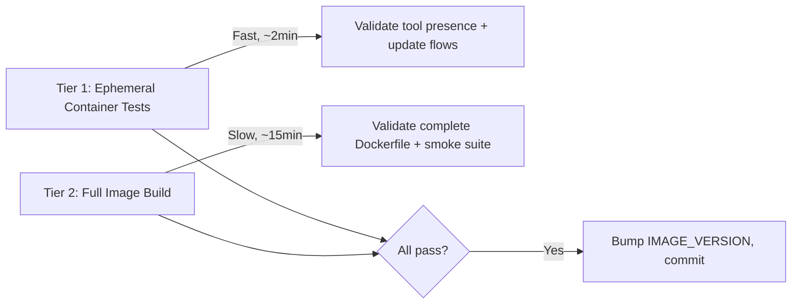

# Container Tooling Batch Change

> **Scope**: Add new tools to the container image, add in-container update support for 6 agent tools, and validate with a two-tier testing strategy.
> **Image version bump**: `0.2.2` → `0.3.0`. CLI version bump should stay in sync with it.

---

## Current State Summary

| Layer | Key files |
|-------|-----------|
| Image build | [Dockerfile](file:///home/mitchell/Documents/Mycode/dune/Dockerfile) — single-stage `debian:12-slim` |
| Container scripts | [install-rally.sh](file:///home/mitchell/Documents/Mycode/dune/container/base/scripts/install-rally.sh), [configure-agents.sh](file:///home/mitchell/Documents/Mycode/dune/container/base/scripts/configure-agents.sh), [setup-persist.sh](file:///home/mitchell/Documents/Mycode/dune/container/base/scripts/setup-persist.sh) |
| Shell config | [.agent-shell-setup.sh](file:///home/mitchell/Documents/Mycode/dune/container/base/home-defaults/.agent-shell-setup.sh), [.zshrc](file:///home/mitchell/Documents/Mycode/dune/container/base/home-defaults/.zshrc) |
| Smoke tests | [base-image.sh](file:///home/mitchell/Documents/Mycode/dune/test/smoke/base-image.sh), [dune-local.sh](file:///home/mitchell/Documents/Mycode/dune/test/smoke/dune-local.sh) |
| Version file | [IMAGE_VERSION](file:///home/mitchell/Documents/Mycode/dune/container/base/IMAGE_VERSION) (`0.2.2`) |

**What's already installed**: gitui ✅ (binary from GH release, line 116–120), codex ✅ (npm, line 127), opencode ✅ (npm, line 128), claude ✅ (install.sh, line 178), rally ✅ (install-rally.sh, line 180), beads_rust ✅ (GH release, line 107–115).

---

## Workstream 1 — New Tool Installations

### 1A. `ping` (apt)

**File**: `Dockerfile` line 32–60

Add `iputils-ping` to the existing apt block:

```diff
     tmux \
     tree \
+    tre-command \
+    iputils-ping \
     tzdata \
```

> [!NOTE]
> This also covers **1B (tre)** — `tre-command` is the Debian 12 package name. Both are cheap apt additions to the existing `RUN` layer.

**Verification**: `ping -c1 127.0.0.1`, `tre --version`

### 1B. `tre` (apt) — merged with 1A above

### 1C. `openspec` CLI (npm)

**File**: `Dockerfile` line 126–134

Add to the existing `npm install -g` block:

```diff
 RUN npm install -g \
+    @anthropic-ai/claude-code \
+    @google/gemini-cli \
+    @fission-ai/openspec \
     @openai/codex \
     opencode-ai \
```

> [!IMPORTANT]
> This also **consolidates claude and gemini CLI installs into the npm layer** instead of using separate install scripts. Claude is currently installed via `curl | bash` (line 178). Moving it to the npm block is cleaner and removes a separate network round-trip. The `curl -fsSL https://claude.ai/install.sh | bash` line should be removed.

**Verification**: `openspec --version`

### 1D. `gemini` CLI (npm) — merged with 1C above

**Verification**: `gemini --version`

### 1E. `laps` CLI (curl install script)

**File**: New script `container/base/scripts/install-laps.sh`

```bash
#!/usr/bin/env bash
set -euo pipefail

tmpdir="$(mktemp -d)"
cleanup() { rm -rf "${tmpdir}"; }
trap cleanup EXIT

curl -fsSL https://raw.githubusercontent.com/mitchell-wallace/laps/main/install.sh \
  -o "${tmpdir}/install.sh"
bash "${tmpdir}/install.sh"
```

**File**: `Dockerfile` — COPY the script and invoke alongside rally:

```diff
 COPY container/base/scripts/install-rally.sh /usr/local/bin/install-rally.sh
+COPY container/base/scripts/install-laps.sh /usr/local/bin/install-laps.sh
 COPY container/base/scripts/setup-persist.sh /usr/local/bin/setup-persist.sh
```

```diff
-RUN chmod 0755 /usr/local/bin/configure-agents.sh /usr/local/bin/install-rally.sh /usr/local/bin/setup-persist.sh \
+RUN chmod 0755 /usr/local/bin/configure-agents.sh /usr/local/bin/install-rally.sh /usr/local/bin/install-laps.sh /usr/local/bin/setup-persist.sh \
```

```diff
   && if [ "${INSTALL_RALLY}" = "1" ]; then runuser -u agent -- bash -lc '/usr/local/bin/install-rally.sh'; fi
+  && runuser -u agent -- bash -lc '/usr/local/bin/install-laps.sh'
```

**Verification**: `laps version`

### 1F. `gitui` — already installed ✅

Already handled at Dockerfile lines 12, 86–87, 116–121. No changes needed.

---

## Workstream 2 — In-Container Update Support

### Goal

Provide a single `update-tools.sh` script baked into the image that users can run to update agent tools inside a running container. This script should:

1. Accept a tool name (or `--all`) as argument
2. Support version pinning (`update-tools.sh claude 2.1.120`)
3. Handle npm-based tools uniformly
4. Handle rally and laps via their install scripts (which already support self-update)

### 2A. Create `container/base/scripts/update-tools.sh`

```bash
#!/usr/bin/env bash
set -euo pipefail

usage() {
  cat <<'EOF'
Usage: update-tools [--all | TOOL [@VERSION]]

Tools: claude, codex, opencode, gemini, rally, laps

Examples:
  update-tools --all          # update all tools to latest
  update-tools claude         # update claude to latest
  update-tools codex 0.125.0  # pin codex to specific version
EOF
  exit "${1:-0}"
}

NPM_TOOLS=(
  "claude:@anthropic-ai/claude-code"
  "codex:@openai/codex"
  "opencode:opencode-ai"
  "gemini:@google/gemini-cli"
)

update_npm_tool() {
  local name="$1" pkg="$2" version="${3:-latest}"
  echo "→ Updating ${name} (${pkg}@${version})..."
  npm install -g "${pkg}@${version}"
  echo "  ✓ ${name} updated"
}

update_rally() {
  local version="${1:-}"
  echo "→ Updating rally..."
  if [ -n "${version}" ]; then
    RALLY_VERSION="${version}" bash /usr/local/bin/install-rally.sh
  else
    bash /usr/local/bin/install-rally.sh
  fi
  echo "  ✓ rally updated"
}

update_laps() {
  local version="${1:-}"
  echo "→ Updating laps..."
  if [ -n "${version}" ]; then
    LAPS_VERSION="${version}" bash /usr/local/bin/install-laps.sh
  else
    bash /usr/local/bin/install-laps.sh
  fi
  echo "  ✓ laps updated"
}

update_single() {
  local tool="$1" version="${2:-}"
  for entry in "${NPM_TOOLS[@]}"; do
    local key="${entry%%:*}" pkg="${entry#*:}"
    if [ "${key}" = "${tool}" ]; then
      update_npm_tool "${key}" "${pkg}" "${version:-latest}"
      return 0
    fi
  done
  case "${tool}" in
    rally) update_rally "${version}" ;;
    laps)  update_laps "${version}" ;;
    *)     echo "Unknown tool: ${tool}" >&2; usage 1 ;;
  esac
}

if [ "$#" -eq 0 ]; then usage; fi

update_all() {
  for entry in "${NPM_TOOLS[@]}"; do
    local key="${entry%%:*}" pkg="${entry#*:}"
    update_npm_tool "${key}" "${pkg}" "latest"
  done
  update_rally ""
  update_laps ""
}

case "$1" in
  --all)     update_all ;;
  -h|--help) usage ;;
  *)         update_single "$@" ;;
esac
```

> [!NOTE]
> Rally ≥ 0.3.0 and Laps ≥ 0.4.4 support `RALLY_VERSION` / `LAPS_VERSION` env var pinning in their install scripts. The `update-tools.sh` script passes the version through these env vars.

### 2B. Wire into Dockerfile

```diff
 COPY container/base/scripts/install-rally.sh /usr/local/bin/install-rally.sh
 COPY container/base/scripts/install-laps.sh /usr/local/bin/install-laps.sh
+COPY container/base/scripts/update-tools.sh /usr/local/bin/update-tools.sh
 COPY container/base/scripts/setup-persist.sh /usr/local/bin/setup-persist.sh
```

And add to the `chmod` line.

### 2C. Update `.agent-shell-setup.sh` alias

Add a convenience alias in [.agent-shell-setup.sh](file:///home/mitchell/Documents/Mycode/dune/container/base/home-defaults/.agent-shell-setup.sh):

```diff
+alias ut='update-tools'
```

---

## Workstream 3 — Testing Strategy

### Two-Tier Approach



### Tier 1 — Ephemeral Integration Tests

**New file**: `test/smoke/tool-updates.sh`

Run against an **already-built** base image (skip the build). Spins up a container and tests:

#### 1. Tool presence checks (extends existing smoke assertions)

```bash
# New tools
assert_container_command "tre --version"
assert_container_command "ping -c1 127.0.0.1"
assert_container_command "openspec --version"
assert_container_command "laps version"
assert_container_command "gemini --version"
```

#### 2. npm tool update/downgrade flows

For each npm-managed tool, test pin → verify → update-to-latest → verify:

| Tool | Pin version | Verify command |
|------|------------|----------------|
| Claude | `2.1.120` | `claude --version \| grep 2.1.120` |
| Codex | `0.125.0` | `codex --version \| grep 0.125.0` |
| OpenCode | `1.14.28` | `opencode --version \| grep 1.14.28` |
| Gemini | `0.39.1` | `gemini --version \| grep 0.39.1` |

```bash
# Example pattern for each npm tool:
docker exec "${CONTAINER}" bash -lc "update-tools codex 0.125.0"
docker exec "${CONTAINER}" bash -lc "codex --version | grep -q 0.125.0"
docker exec "${CONTAINER}" bash -lc "update-tools codex"
# Verify version changed (is no longer the pinned one)
```

#### 3. rally + laps update flows

```bash
# Rally: pin to earliest safe version, then update
docker exec "${CONTAINER}" bash -lc "update-tools rally 0.3.0"
docker exec "${CONTAINER}" bash -lc "rally --version | grep -q 0.3.0"
docker exec "${CONTAINER}" bash -lc "update-tools rally"

# Laps: pin to earliest safe version, then update
docker exec "${CONTAINER}" bash -lc "update-tools laps 0.4.4"
docker exec "${CONTAINER}" bash -lc "laps version | grep -q 0.4.4"
docker exec "${CONTAINER}" bash -lc "update-tools laps"
```

> [!TIP]
> These ephemeral tests should take ~2-3 minutes. Run them first during development to iterate quickly before committing to a full build.

### Tier 2 — Full Image Build Smoke Tests

**File**: Update [base-image.sh](file:///home/mitchell/Documents/Mycode/dune/test/smoke/base-image.sh) lines 99–125

Add the new tool assertions alongside existing ones:

```diff
 assert_container_command "gitui --version"
+assert_container_command "tre --version"
+assert_container_command "ping -c1 127.0.0.1"
+assert_container_command "openspec --version"
+assert_container_command "laps version"
+assert_container_command "gemini --version"
+assert_container_command "update-tools --help"
 
 assert_container_command "claude --version"
```

---

## Implementation Order

> [!IMPORTANT]
> Each step should be committed separately to checkpoint progress.

### Step 1: Dockerfile changes (tools + claude npm consolidation)
1. Add `iputils-ping` and `tre-command` to apt block
2. Move claude to npm block, add gemini + openspec to npm block
3. Create `install-laps.sh`, wire into Dockerfile
4. Remove `curl -fsSL https://claude.ai/install.sh | bash` from line 178
5. **Commit checkpoint**: `go build ./...` should still pass (Dockerfile-only change)

### Step 2: Update mechanism
1. Create `update-tools.sh`
2. Wire into Dockerfile (COPY + chmod)
3. Add alias to `.agent-shell-setup.sh`
4. **Commit checkpoint**

### Step 3: Testing
1. Update `base-image.sh` with new assertions
2. Create `tool-updates.sh` for ephemeral update tests
3. **Test Tier 1**: `bash test/smoke/tool-updates.sh --skip-build --image <existing-image>`
4. **Test Tier 2**: `bash test/smoke/base-image.sh` (full build, ~15min)
5. **Commit checkpoint**

### Step 4: Version bump + finalize
1. Bump `container/base/IMAGE_VERSION` to `0.3.0`
2. Final commit + push

---

## Decisions (Confirmed)

1. **Claude install consolidation** ✅ — Move from `curl | bash` to `npm i -g @anthropic-ai/claude-code`. Cleaner, uniform with other npm tools.
2. **`update-tools.sh` location** ✅ — `/usr/local/bin/update-tools.sh` with `ut` alias.
3. **Version bump** ✅ — `0.2.2` → `0.3.0`.
4. **Rally/Laps version pinning** ✅ — Both install scripts now support `RALLY_VERSION`/`LAPS_VERSION` env vars. Earliest safe versions: rally `0.3.0`, laps `0.4.4`.

---

## Version Pin Reference

| Tool | Package | Earliest safe test pin | Env var |
|------|---------|----------------------|--------|
| Claude Code | `@anthropic-ai/claude-code` | `2.1.110` | — (npm) |
| Codex CLI | `@openai/codex` | `0.117.0` | — (npm) |
| OpenCode | `opencode-ai` | `1.14.22` | — (npm) |
| Gemini CLI | `@google/gemini-cli` | `0.38.0` | — (npm) |
| Rally | mitchell-wallace/rally | `0.3.0` | `RALLY_VERSION` |
| Laps | mitchell-wallace/laps | `0.4.4` | `LAPS_VERSION` |
